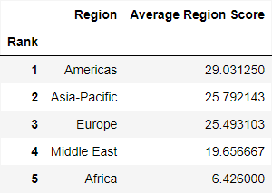

# LeadingAI - Visualising global AI state actors
### Data Visualization (COM-480) - 2024 Project

| Student's name | SCIPER |
|---|---|
| Quentin Esteban | 288211 |
| Malo Ranzetti | 296956 |
| Anne Silvestre de Sacy| 360399|

[Milestone 1](#milestone-1) • [Milestone 2](#milestone-2) • [Milestone 3](#milestone-3)

## Milestone 1 (29th March, 5pm)

### [FULL REPORT](milestone-1/Data_Visualization_Milestone_1.pdf)

### Dataset
TODO

### Problematic

Given the recent development of the AI industry and its apparent impact on our society, it is relevant to see which countries are the current leading actors and why. The dataset we are using is from the article ["Artificial Intelligence on the World Stage: Dominant Players and Aspiring Challengers"](https://intersog.com/blog/ai-dominant-players-and-aspiring-challengers/).

The main objective of the project is to make an interactive map to efficiently show the different factors which impact a country's capabilities in the AI sector and hence ease the decision making process in this industry. In the storytelling we want to show which countries form leading cliques, with a great importance on the "why?". Our target audience is not only the general public, but individuals from inside the sector, and institutions or governmental agencies likely to have interest in AI. This is why we aim for a sleek, modern and professional look.

### Exploratory Data Analysis

We can directly observe that the data will allow us to build interesting statistics. 

Figure 1 shows the top 5 leading state actors globally. What is interesting is that using the dataset we can construct a ranking of leading regions globally, as shown in Figure 2. 

Finally, we give some more general statistics based on each individual class on which the total score depends, as shown in Figure 3.

Overall, we can see that the individual classes do not have centered means and that there is fluctuating intra-class variance. We will therefore need to communicate this to the target audience. We can also see that coupling this data with another dataset could be very interesting. It is important to note that not all countries of the world are included in the dataset, as we only have 62 entries.

### Related work

Given the leading theme of our project, we found the following works from which we could draw some inspiration.

First, the [AI Global - ‘Where in the World is AI?’ map](https://map.ai-global.org/), also showing data related to AI. This map shows the countries that are using AI in various domains between 2005 and 2021. This map is interesting because it has different colours to show the different domains which we also want to do to have a clear visual distinction between the different indicators we will represent. \autoref{fig:AI_Global}

Then, the [‘Global Conflict Tracker’](https://www.cfr.org/global-conflict-tracker) map. This map doesn’t show data related to AI but to the different conflicts in the world. This map is interesting for its design. The use of soft colours for the map enables to highlight key information with darker tones. Compared to the first one it looks more professional which is more relevant to our project.

This dataset has mainly been used with machine learning prediction algorithms. Our project will be more informative and build on data to highlight the information it gives.

## Milestone 2 (26th April, 5pm)

**10% of the final grade**

## Milestone 3 (31st May, 5pm)

**80% of the final grade**

## Late policy

- < 24h: 80% of the grade for the milestone
- < 48h: 70% of the grade for the milestone

